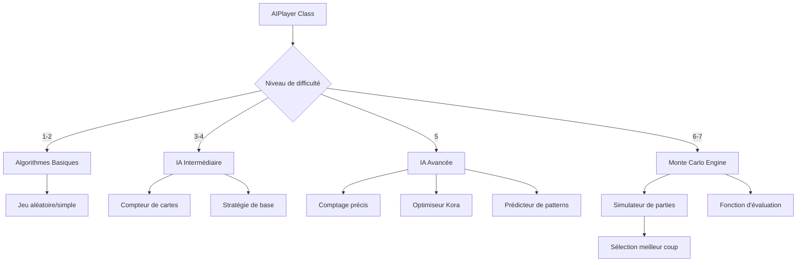

# Plan : IA Avancée avec 7 Niveaux de Difficulté

## Architecture Proposée




## 1. Restructuration des Niveaux de Difficulté

**Fichier** : [`convex/validators.ts`](convex/validators.ts)Remplacer `aiDifficultyValidator` pour supporter 7 niveaux :

- `beginner` : Joue aléatoirement
- `easy` : Comprend les règles de base mais fait des erreurs
- `medium` : Stratégie simple sans anticipation
- `hard` : Compte les cartes et anticipe 1-2 tours
- `expert` : Optimise Kora et contrôle la main
- `master` : Monte Carlo (50-100 simulations)
- `grandmaster` : Monte Carlo optimisé (200-500 simulations)

## 2. Système de Comptage de Cartes Précis

**Nouveau module** : `convex/cardTracker.ts`Créer une classe `CardTracker` qui :

- Maintient l'état exact de toutes les cartes (jouées, en main IA, inconnues)
- Calcule les probabilités précises pour chaque carte restante
- Identifie les couleurs faibles/fortes de l'adversaire
- Détecte les opportunités de Kora en temps réel
```typescript
class CardTracker {
  private playedCards: Set<string>
  private aiHand: Card[]
  private remainingCards: Card[]
  
  getProbability(card: Card): number
  getOpponentPossibleCards(): ProbabilityCard[]
  getWeakSuits(): Suit[]
  detectKoraOpportunity(): KoraAnalysis
}
```


## 3. Optimiseur de Stratégie Kora

**Fichier** : [`convex/aiPlayer.ts`](convex/aiPlayer.ts)Améliorer la détection et l'exécution des Kora :

### Kora Simple (x2)

- Identifier si on a un 3 pour le tour 5
- Calculer la probabilité de gagner avec ce 3
- Protéger le 3 pendant les tours 1-4

### Double Kora (x4)

- Détecter si on a 2+ cartes de 3
- Planifier pour gagner tours 4 et 5 avec des 3
- Prioriser la conservation des 3 dès le tour 1

### Triple Kora (x8)

- Nécessite 3 cartes de 3
- Stratégie ultra-agressive pour garder la main tours 3-5
- Sacrifier les autres cartes pour protéger les 3

## 4. Algorithme Monte Carlo (Niveaux 6-7)

**Nouveau module** : `convex/monteCarlo.ts`

### Principe

Pour chaque coup possible, simuler N parties aléatoires et choisir le coup avec le meilleur taux de victoire.

```typescript
class MonteCarloSimulator {
  simulate(gameState: Game, card: Card, numSimulations: number): SimulationResult
  
  // Pour chaque simulation :
  // 1. Distribuer aléatoirement les cartes inconnues à l'adversaire
  // 2. Jouer le reste de la partie avec stratégie optimale
  // 3. Calculer le score (victoire normale, Kora x2/x4/x8)
  // 4. Moyenner les résultats
}
```


### Fonction d'Évaluation

Scoring pour chaque issue :

- Victoire normale : +1
- Victoire Kora simple : +2
- Victoire Double Kora : +4
- Victoire Triple Kora : +8
- Défaite : -1
- Défaite avec Kora adverse : -2/-4/-8

### Optimisations

- Parallélisation des simulations (si possible en Convex)
- Élagage alpha-beta pour réduire l'arbre de recherche
- Cache des positions déjà évaluées

## 5. Amélioration de la Stratégie Globale

### Gestion de la Main

- **Garder la main** : Quand on a des cartes fortes ou des 3 pour Kora
- **Céder la main** : Quand on veut forcer l'adversaire à jouer une couleur faible

### Stratégie par Tour

**Tours 1-2** : Phase d'exploration

- Jouer des cartes moyennes (5-7)
- Observer les réponses adverses
- Identifier les couleurs faibles

**Tours 3-4** : Phase tactique

- Si opportunité Kora : protéger les 3
- Sinon : contrôler la main avec cartes hautes
- Forcer l'adversaire sur ses couleurs faibles

**Tour 5** : Phase décisive

- Si Kora possible : jouer le 3 en position gagnante
- Sinon : jouer la carte la plus haute dans la meilleure couleur

## 6. Prédiction des Cartes Adverses

Utiliser :

- Comptage exact des cartes jouées
- Analyse des défausses (quelles couleurs l'adversaire n'a pas)
- Patterns de jeu (agressif vs conservateur)
- Probabilités bayésiennes pour affiner les prédictions

## 7. Modifications de l'Interface

**Fichier** : [`convex/gameEngine.ts`](convex/gameEngine.ts)Mettre à jour les constantes AI :

```typescript
const AI_BOT_IDS = {
  beginner: "ai-ndougouma",
  easy: "ai-bindi",
  medium: "ai-ndoss",
  hard: "ai-bandi",
  expert: "ai-serigne",
  master: "ai-el-hadj",
  grandmaster: "ai-grand-serigne"
}
```

**Fichier** : [`convex/games.ts`](convex/games.ts)Adapter les mutations pour supporter les nouveaux niveaux.

## 8. Tests et Calibration

Créer un système de benchmark pour :

- Faire jouer les IAs entre elles
- Mesurer le taux de victoire par niveau
- Calibrer les paramètres (Monte Carlo simulations, agressivité, etc.)
- Vérifier que chaque niveau est environ 10-15% plus fort que le précédent

## Résumé Technique

| Niveau | Algorithme | Complexité ||--------|-----------|------------|| 1-2 | Aléatoire/Règles | O(n) || 3-4 | Heuristiques + Comptage | O(n²) || 5 | Stratégie avancée + Prédiction | O(n³) |